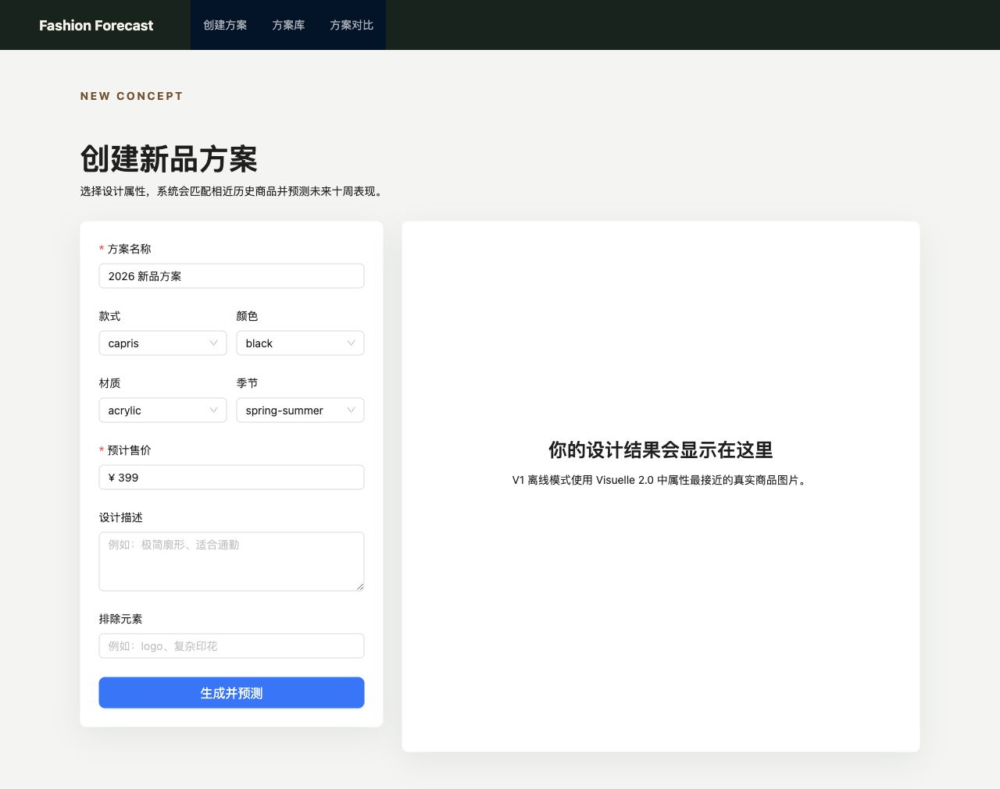
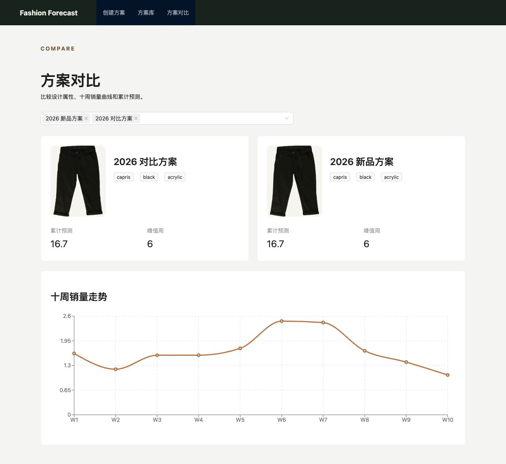

# Fast Fashion Design & Demand Forecasting

Portfolio-oriented reconstruction of a fast-fashion womenswear design and demand forecasting platform. V1 preserves the original product intent while rebuilding the workflow, interface, forecasting boundary, and engineering structure.





## What it does

- Builds a womenswear concept from category, color, fabric, season, price, and design notes
- Accepts a user-uploaded design image, with a text-to-image provider planned as a separate adapter
- Forecasts the next ten weeks only when a validated trained artifact is configured
- Separates statistical output from deterministic narrative insights
- Saves concepts and compares two forecast curves side by side

## V1 workflow

Create or upload a design concept, run it through an exported ten-week forecast model, review market insights, save the concept, and compare two concepts.

## Model status

No product inference artifact is configured yet. This is deliberate: Visuelle 2.0 is a training and evaluation dataset, not an online product data source. Until training and held-out evaluation are complete, the forecast API returns an explicit unavailable status.

See `docs/MODEL_CARD.md`.

## Local setup

### Backend

Python 3.9 or newer is required.

```bash
python -m venv .venv
source .venv/bin/activate
pip install -r backend/requirements.txt
python backend/manage.py migrate
python backend/manage.py runserver
```

### Frontend

```bash
cd frontend
npm install
npm run dev
```

### Offline training-data validation

The full `visuelle2` directory is intentionally excluded from Git.

```bash
python scripts/validate_dataset.py --root ./visuelle2
```

## API

```text
GET    /api/options/
POST   /api/designs/generate/
GET    /api/designs/
GET    /api/designs/{id}/
DELETE /api/designs/{id}/
POST   /api/designs/{id}/forecast/
POST   /api/designs/{id}/insights/
POST   /api/designs/compare/
GET    /api/health/
```

## Reproduction policy

This is a functional reconstruction and product redesign, not a pixel-for-pixel copy of the historical graduation project. Product intent and core capabilities are preserved; low-value administration screens and fragile infrastructure are deferred. The product itself is not Agent-driven. Agent/Codex usage belongs to the development-learning record only.

See `docs/PRODUCT_SPEC.md`, `docs/REPRODUCTION_SCOPE.md`, and `docs/ARCHITECTURE.md`.
